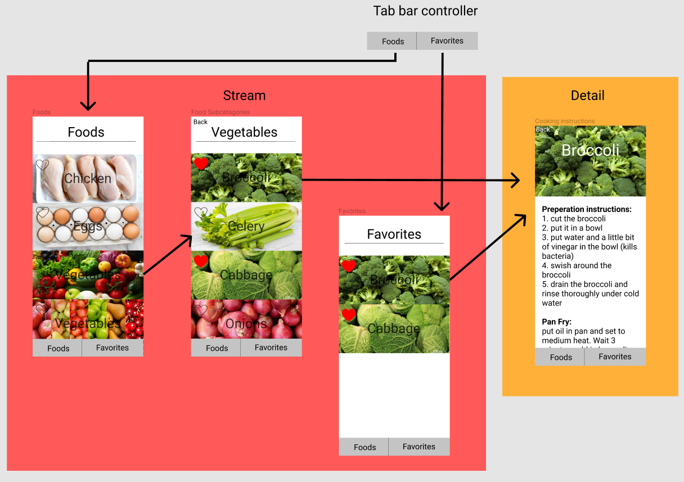

# Basic Recipes

## Table of Contents
1. [Overview](#Overview)
1. [Product Spec](#Product-Spec)
1. [Wireframes](#Wireframes)
2. [Schema](#Schema)

## Overview
### Description
An App that gives very clear and concise cooking instructions for staples like chicken, pancakes, eggs, etc. There is a paid version which offers simple additions to the recepies, likes spice mixes for chicken. It also has a measurement calculator and substitutes for missing ingredients.
### App Evaluation
[Evaluation of your app across the following attributes]
- **Category:**
Instructional, Food
- **Mobile:**
Specificly for mobile apps 
- **Story:**
First time home cooks and those living by themselves don't know how to make basic dishes. Tells you in no uncertain terms what to do.
- **Market:**
Young people and new cooks living alone wanting clear instructions without filler.
- **Habit:**
People need to eat, and this app can help people get comfortable with cooking. This allows them to cook for themselves daily with basic instructions for basic meals.
- **Scope:**
People who are new to cooking, or who cook rarely and need clear and concise cooking instructions. This May be college students, or those who are living alone for the first time.

## Product Spec

### 1. User Stories (Required and Optional)

**Required Must-have Stories**

* List of items you can learn to cook, and their tutorials
* You can favorite items, and they appear in a favorite items tab

**Optional Nice-to-have Stories**

* User can pay $1.99 to get paid features
* Paid feature: can access basic recipe entensions like spice mixes to improve their cooking in an uncomplicated manner
* Paid feature: It can auto-adjust ingrediant amounts based on user input
* Paid feature: Suggest substituitons if you are missing any of the ingrediants from a recipe.

### 2. Screen Archetypes

* Food Catagory Screen/Tab
   * Specific recipes in that food catagory
* Favorite Recipes Screen/Tab
   * A subcatagory screen
* Subcatagory Screen
   * A specific recipe screen
* Specific Recipe Screen

### 3. Navigation

**Tab Navigation** (Tab to Screen)

* Food Catagory Screen
* Favorite Recipes

**Flow Navigation** (Screen to Screen)

* Food Catagory Screen -> Subcatagory Screen -> Specific Recipe Screen
* Favorite Recipes Screen -> Specific Recipe Screen

## Wireframes

### [BONUS] Digital Wireframes & Mockups

### [BONUS] Interactive Prototype

## Schema 
[This section will be completed in Unit 9]
### Models
[Add table of models]
