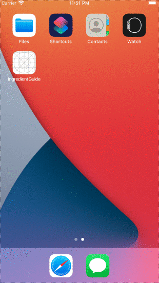

# Ingredient Guide

## Table of Contents
1. [Overview](#Overview)
1. [Product Spec](#Product-Spec)
1. [Wireframes](#Wireframes)
2. [Schema](#Schema)

## Overview
### App Walkthrough GIF
Here's a walkthrough of the current application:

Unit 12


Unit 11


Unit 10



Unit 9


GIF created with [Gifski](https://apps.apple.com/us/app/gifski/id1351639930?mt=12).

### Description
The main idea is that you don't have to search for basic, "How do I cook *blank*." The app just tells you a number of ways to prepare the raw ingredient.
The app gives very clear and concise cooking instructions for staples like chicken, pancakes, eggs, etc. There is a paid version which offers simple additions like basic, reliable recepies. It also has a measurement calculator and substitutes for missing ingredients.
### App Evaluation
[Evaluation of your app across the following attributes]
- **Category:**
Instructional, Food
- **Mobile:**
Specificly for mobile apps 
- **Story:**
First time home cooks and those living by themselves don't know how to make basic dishes. Tells you in no uncertain terms what to do.
- **Market:**
Young people and new cooks living alone wanting clear instructions without filler.
- **Habit:**
People need to eat, and this app can help people get comfortable with cooking. This allows them to cook for themselves daily with basic instructions for basic meals.
- **Scope:**
People who are new to cooking, or who cook rarely and need clear and concise cooking instructions. This May be college students, or those who are living alone for the first time.

## Product Spec

### 1. User Stories (Required and Optional)

**Required Must-have Stories**

- [x] List of items you can learn to cook, at least one food completed (broccoli)
- [x] User can favorite foods
- [x] App has category, food, and favorite page
- [x] App successfully use back4app parse server for data
- [x] User stays logged in across restarts
- [x] User can log out
- [x] User select food types
- [x] User can select specific foods

**Optional Nice-to-have Stories**

- [ ] Search bar on each catagory page
- [ ] User can pay $1.99 to get paid features
- [ ] Paid feature: can access basic recipe entensions like spice mixes to improve their cooking in an uncomplicated manner
- [ ] Paid feature: It can auto-adjust ingrediant amounts based on user input
- [ ] Paid feature: Suggest substituitons if you are missing any of the ingrediants from a recipe.

### 2. Screen Archetypes

* Food Catagory Screen/Tab
   * Main page list of food catagories
* Food Subcatagory Screen
   * Specific foods in catagory
* Specific Food Screen
   * Specific types of preparation instructions
* Favorite Food Screen/Tab
   * A screen of specific foods
* Settings Screen
   * Can go to login screen 
   * Can logout
* Login Screen
   * You can login


### 3. Navigation

**Tab Navigation** (Tab to Screen)

* Food Catagory Screen
* Favorite Recipes

**Flow Navigation** (Screen to Screen)

* Food Catagory Screen -> Food Subcatagory Screen -> Specific Food Screen
* Favorite Recipes Screen -> Specific Food Screen

## Wireframes
### [BONUS] Digital Wireframes & Mockups


### [BONUS] Interactive Prototype

## Schema 
[This section will be completed in Unit 9]
### Models
[Add table of models]
### Networking
- [Add list of network requests by screen ]
- [Create basic snippets for each Parse network request]
- [OPTIONAL: List endpoints if using existing API such as Yelp]

#### Post

##### Category object
   | Property      | Type        | Description                      |
   | ------------- | ----------- | -------------------------------- |
   | Name          | String      | Name of the category             |
   | Image         | File        | Image of food type               |
##### Food object
   | Property      | Type               | Description                             |
   | ------------- | ------------------ | --------------------------------------- |
   | Category      | String             | Name of the category it is apart of     |
   | Name          | String             | Name of the food                        |
   | Image         | File               | Image of the food                       |
##### Preparation object
   | Property      | Type         | Description                                      |
   | ------------- | ------------ | ------------------------------------------------ |
   | Food          | String       | Name of food it is for                           |
   | Name          | String       | Name of the way of preparing                     |
   | Preparation   | Array        | Array of strings with the instruction steps      |
   | Image         | File         | Image or gif of instructions/food being prepared |

### Networking
#### List of network requests by screen
   - Food Category Screen
      - (Read/GET) Query all Catagory objects
         ```swift
         var foodCategories = [PFObject]()
         
         let query = PFQuery(className:"Category")
         query.findObjectsInBackground { (fetchedCategories: [PFObject]?, error: Error?) in
            if let error = error {
               print(error.localizedDescription)
            } else if let categories = fetchedCategories {
               foodCategories = categories
            }
         }
         ```
   - Food Subcatagory Screen
      - (Read/GET) Query all food objects pointed to in catagory object
         ```swift
         // clickedIndex would be the index of the category clicked on
         var categoryName = foodCategories[clickedIndex]["name"] as! String
         
         var individualFoods = [PFObject]()
         
         let query = PFQuery(className:"Food")
         query.whereKey("category", equalTo: categoryName)
         query.findObjectsInBackground { (fetchedFoods: [PFObject]?, error: Error?) in
            if let error = error {
               print(error.localizedDescription)
            } else if let foods = fetchedFoods {
               individualFoods = foods
            }
         }
         ```
   - Specific Food Screen
      - (Read/GET) Query all preparation objects pointed to in food object
         ```swift
         // clickedIndex would be the index of the food clicked on
         var foodName = individualFoods[clickedIndex]["name"] as! String
         
         var individualPreparations = [PFObject]()
         
         let query = PFQuery(className:"Preparation")
         query.whereKey("food", equalTo: foodName)
         query.findObjectsInBackground { (fetchedPreparations: [PFObject]?, error: Error?) in
            if let error = error {
               print(error.localizedDescription)
            } else if let preparations = fetchedPreparations {
               individualPreparations = preparations
            }
         }
         ```
   - Favorite Food Screen/Tab
      - (Read/GET) Query user favoriate foods
         ```swift
         let query = PFQuery(className:"Post")
         query.whereKey("author", equalTo: currentUser)
         query.order(byDescending: "createdAt")
         query.findObjectsInBackground { (posts: [PFObject]?, error: Error?) in
            if let error = error { 
               print(error.localizedDescription)
            } else if let posts = posts {
               print("Successfully retrieved \(posts.count) posts.")
           // TODO: Do something with posts...
            }
         }
         ```
   - Settings Screen
   - Login Screen
      - (Read/GET) Query user credentials
         ```swift
        @IBAction func onLogin(_ sender: Any) {
        // Login user
    
        // Check text field inputs
        if usernameAndPasswordNotEmpty() {
            let username = usernameTextField.text ?? ""
            let password = passwordTextField.text ?? ""
            
            PFUser.logInWithUsername(inBackground: username, password: password) { (user: PFUser?, error: Error?) in
                if let error = error {
                    print("User log in failed: \(error.localizedDescription)")
                    self.displayLoginError(error: error)
                } else {
                    print("User \(username) logged in successfully")
                    // display view controller that needs to shown after successful login
                    NotificationCenter.default.post(name: NSNotification.Name("login"), object: nil)

                    
                }
            }
        }
        
         ```
      - (Create/POST) Create and login new user
        ```swift
        @IBAction func onSignUp(_ sender: Any) {
        // Sign up user
        // Check text field inputs
        if usernameAndPasswordNotEmpty() {
            // initialize a user object
            let newUser = PFUser()
            
            // set user properties
            newUser.username = usernameTextField.text
            newUser.password = passwordTextField.text
            
            // call sign up function on the object
            newUser.signUpInBackground { (success: Bool, error: Error?) in
                if let error = error {
                    print(error.localizedDescription)
                    self.displaySignupError(error: error)
                } else {
                    print("User \(newUser.username!) Registered successfully")
                    NotificationCenter.default.post(name: NSNotification.Name("login"), object: nil)
                    
                }
            }
        }
    
    
        @IBAction func onLogin(_ sender: Any) {
        // Login user
    
        // Check text field inputs
        if usernameAndPasswordNotEmpty() {
            let username = usernameTextField.text ?? ""
            let password = passwordTextField.text ?? ""
            
            PFUser.logInWithUsername(inBackground: username, password: password) { (user: PFUser?, error: Error?) in
                if let error = error {
                    print("User log in failed: \(error.localizedDescription)")
                    self.displayLoginError(error: error)
                } else {
                    print("User \(username) logged in successfully")
                    // display view controller that needs to shown after successful login
                    NotificationCenter.default.post(name: NSNotification.Name("login"), object: nil)

                    
                }
            }
        }
